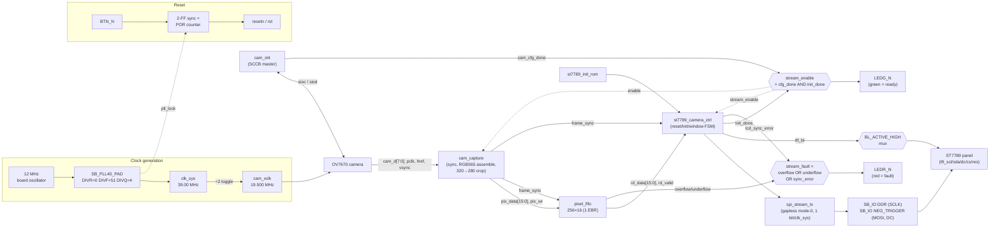

# iCEBreaker OV7670 → ST7789 Live Camera Stream

Pure-Verilog live camera viewfinder for the iCEBreaker (Lattice iCE40UP5K)
board: an OV7670 camera is streamed straight to an ST7789 TFT/IPS panel with
**no CPU, no external RAM, and no full frame buffer**. The ST7789's own GRAM
is the frame store; the FPGA only carries a small FIFO to absorb the
difference between the camera's bursty active-video timing and the panel's
constant SPI drain rate.

```text
OV7670 RGB565 → center-crop 320×240 to 280×240
              → 256×16 synchronous FIFO (one iCE40 EBR)
              → ST7789 RAMWR stream
```

Top-level entity: **`icebreaker_st7789_top`** (`icebreaker_st7789_top.v`).

---

## 1. Repository layout

| Path | Role |
|---|---|
| `icebreaker_st7789_top.v` | Top level: PLL, POR/reset, camera XCLK, SCCB pin, integration, SB_IO pin cells, status LEDs |
| `cam_init.v` | OV7670 SCCB (I²C-like) master — writes the register table on power-up |
| `cam_capture.v` | Synchronizes PCLK/HREF/VSYNC, assembles RGB565 bytes, crops 320→280 columns |
| `pixel_fifo.v` | 256×16 single-clock rate-matching FIFO (infers one iCE40 EBR) |
| `st7789_camera_ctrl.v` | ST7789 reset/init/address-window FSM, streams FIFO pixels into RAMWR |
| `st7789_init_rom.v` | Combinational ROM: the known-working ST7789 register-init sequence (shared by both the camera build and the reference test-pattern build) |
| `spi_stream_tx.v` | Gapless mode-0 SPI byte engine, one bit per `clk_sys` cycle via DDR/NEG_TRIGGER `SB_IO` cells |
| `icebreaker.pcf` | Pin constraints for the build above (see [§6](#6-wiring--pinout)) |
| `Makefile` | `yosys` → `nextpnr-ice40` → `icepack` → `iceprog` build/program flow |
| `timing_check.py` | Recomputes the clock/line-rate/FIFO-margin numbers in [§4](#4-clock-plan) and [§5](#5-line-rate-proof) |
| `timing_39MHz.patch` | Historical patch that dropped the PLL from 39.75→39.00 MHz; already folded into the files above, kept only for the record |
| `unused/` | RTL **not** part of `icebreaker_st7789_top` — see [§1.1](#11-unused--reference-rtl) |

Only the files in the first row through `spi_stream_tx.v` are compiled by
`make` (the exact `Makefile` `SOURCES` list). Everything under `unused/` and
`timing_39MHz.patch` is historical/reference material.

### 1.1 Unused / reference RTL

`unused/` holds the earlier standalone ST7789 test-pattern design that
`icebreaker_st7789_top` was built from. It still synthesizes on its own but
is **not instantiated anywhere in the camera build** and is not in the
Makefile's `SOURCES` list.

| Path | Role |
|---|---|
| `unused/st7789_rgb_test.v` | Old standalone top: hardware reset + init ROM + CASET/RASET/RAMWR + a combinational test-pattern generator, no camera |
| `unused/rgb_test_pattern.v` | Combinational RGB565 test-pattern generator instantiated only by `st7789_rgb_test.v` |
| `unused/spi_master_tx.v` | Older one-cycle-per-bit SPI engine (superseded by `spi_stream_tx.v`'s DDR engine), instantiated only by `st7789_rgb_test.v` |

`st7789_init_rom.v` is instantiated by *both* the current camera build and
`unused/st7789_rgb_test.v`, so it stays at the top level rather than moving
into `unused/`.

---

## 2. Module tree (`icebreaker_st7789_top` instantiation hierarchy)

```text
icebreaker_st7789_top                        (PLL, POR/reset, XCLK gen, LEDs, pin IO cells)
│
├─ SB_PLL40_PAD  "pll"                        [iCE40 primitive] 12 MHz → 39.00 MHz clk_sys
│
├─ cam_init  "camera_config"                  OV7670 SCCB register-write master
│    (drives cam_sioc directly; siod_low → SB_IO below)
│
├─ SB_IO  "cam_siod_io"                       [iCE40 primitive] open-drain SCCB data pin
│
├─ cam_capture  "capture"                     RGB565 capture / crop / frame-sync
│    (enable = stream_enable = cam_cfg_done && lcd_init_done)
│
├─ pixel_fifo  "fifo"                         256×16 rate-matching FIFO
│
├─ st7789_camera_ctrl  "display"               ST7789 reset/init/window/pixel-stream FSM
│    ├─ st7789_init_rom  "init_rom"           combinational panel-init byte ROM
│    └─ spi_stream_tx  "spi"                  gapless mode-0 SPI bit engine
│
├─ SB_IO  "tft_sclk_io"                       [iCE40 primitive] DDR output cell → tft_scl (SCLK)
├─ SB_IO  "tft_mosi_io"                       [iCE40 primitive] NEG_TRIGGER cell → tft_sda (MOSI)
└─ SB_IO  "tft_dc_io"                         [iCE40 primitive] NEG_TRIGGER cell → tft_dc
```

`tft_blk` (backlight pin) is driven directly by the top level:
`assign tft_blk = BL_ACTIVE_HIGH ? bl_raw : ~bl_raw;`, where `bl_raw` comes
straight from `st7789_camera_ctrl`'s `tft_bl` output.

---

## 3. Block diagram



Everything runs in the single `clk_sys` (39.00 MHz) domain — `cam_pclk` is
sampled as synchronized *data*, never used as a clock, so there is no
asynchronous clock-domain crossing anywhere in the design.

---

## 4. Clock plan

| Clock | Value | Source |
|---|---:|---|
| Board oscillator | 12.000 MHz | iCEBreaker |
| FPGA system clock (`clk_sys`) | 39.000 MHz | `SB_PLL40_PAD` |
| ST7789 SCLK | 39.000 MHz | `clk_sys`, via DDR SPI engine |
| OV7670 XCLK | 19.500 MHz | `clk_sys` / 2 |
| OV7670 internal clock | 9.750 MHz | XCLK / 2, `CLKRC = 0x01` |
| OV7670 PCLK | 4.875 MHz | QVGA scaling, PCLK / 2 |

PLL settings: `DIVR=0`, `DIVF=51`, `DIVQ=4`, `FILTER_RANGE=1`
(`12 MHz × (51+1) / 2^4 = 39.00 MHz`).

### Why 39.00 MHz and not higher

- The iCE40 integer PLL cannot land on the originally-requested 39.75 MHz
  from a 12 MHz reference within its VCO/PFD range; 39.00 MHz is the nearest
  valid step below the 39.73 MHz nextpnr had actually closed.
- Once `spi_stream_tx.v` was rebuilt around an `SB_IO` DDR output cell for
  SCLK (full `clk_sys` rate instead of `clk_sys/2`) plus `NEG_TRIGGER`
  cells for MOSI/DC, the extra IO logic shifted placement enough that the
  design's recurring critical path — the asynchronous `BTN_N → tft_cs`
  path — only cleared 42.00 MHz by a 0.17% margin: reproducible, but too
  close to real silicon PVT variation to trust. 39.00 MHz with the new SPI
  engine reproducibly closes with a 43.25 MHz max (10.9% margin), so the
  PLL was left at the safe baseline and all further speed came from the SPI
  engine and `CLKRC` instead.
- The DDR/NEG_TRIGGER phase relationship in `spi_stream_tx.v` was verified
  in simulation against the real iCE40 `SB_IO` behavioral model
  (`cells_sim.v`) before being trusted on hardware: bit-exact byte
  transmission, correct per-byte DC latching, gapless multi-byte bursts,
  discrete (non-merged) SCLK pulses, and confirmation that `tx_done` can't
  let CS cut off the last bit mid-transmission. Getting this phase wrong
  would silently corrupt every byte, so it wasn't something to trust from
  inspection alone.

### Design-evolution summary (fastest → slowest is bottom → top of history)

The frame rate arrived at today (~12.19 fps) is the result of several
rounds of tightening, each gated on the previous one's timing-closure
result:

1. **Baseline** — 240×280 ST7789 test-pattern project (now in `unused/`),
   PS-derived reset/init sequence retained byte-for-byte in
   `st7789_init_rom.v`.
2. **Camera integration** — added `cam_init`/`cam_capture`/`pixel_fifo`,
   `CLKRC=/6`, SPI `/4`. ~4.06 fps.
3. **SPI ÷2 instead of ÷4** — `spi_stream_tx` could already run at
   `clk_sys/2`; raising SCLK to 19.5 MHz let camera `CLKRC` loosen `/6→/3`.
   Same ~4.76% line margin, ~8.13 fps.
4. **PLL → 42.00 MHz** (superseded) — nextpnr had unused margin at 39.00 MHz;
   42.00 MHz (`DIVF=55`) reproducibly closed (verified across three clean
   rebuilds), 43.5 MHz did not. XCLK scales with the PLL, so `CLKRC`
   margin was unchanged. ~8.75 fps.
5. **DDR SPI engine, PLL reverted to 39.00 MHz** — rebuilding `spi_stream_tx`
   around `SB_IO` DDR/NEG_TRIGGER cells doubled SPI to a full `clk_sys`, but
   changed placement pressure enough that 42.00 MHz's `BTN_N→tft_cs` margin
   collapsed to 0.17%. Reverting the PLL to 39.00 MHz restored a 10.9%
   margin with the new SPI engine in place.
6. **`CLKRC` tightened `/3 → /2`** — safe now that SPI runs twice as fast;
   `CLKRC=/1` (bypass) was checked and rejected (camera would outrun the
   display even at the new SPI rate). Line-time margin actually *grew*
   (4.76% → 28.6%) even as the camera clock also grew 1.5×, because SPI
   grew faster still. **Current state: ~12.19 fps.**

(Two early DDR-engine bugs were caught only by simulation against the real
`SB_IO` model, not by inspection: tying both DDR phases to the same signal
merged consecutive bit pulses into one long pulse instead of discrete
per-bit pulses, and a mixed-up `PIN_TYPE` encoding made the MOSI/DC cells
combinational instead of registered.)

---

## 5. Line-rate proof

Using the OV7670 QVGA timing assumption (1568 internal-clock cycles/line):

```text
camera line time = 1568 / 9.750 MHz  = 160.82 us
display line time = 280 × 16 / 39.000 MHz = 114.87 us
line slack        = 45.95 us = 28.6%
```

The center crop keeps camera columns 20–299. With the display draining
faster than before, the active-video input/output pixel rates work out
algebraically equal (`CAM_INT_HZ/4 == SPI_HZ/16`), so the FIFO barely moves
during the retained active region rather than the ~70-pixel peak of the
earlier (`sys_clk/2` SPI) build. The 256-entry FIFO is now far larger than
steady state requires but costs nothing extra to keep (one EBR either way).

Nominal frame rate ≈ **12.19 fps** (linear scaling from the preliminary
design's 10 fps at an 8 MHz camera internal clock). Run:

```sh
python3 timing_check.py
```

to recompute all of the numbers above from the live clock parameters.

---

## 6. Display geometry & camera configuration

- Panel operated in landscape mode: `MADCTL = 0xA0`.
- Visible stream: 280 × 240 pixels. `CASET = 20..299`, `RASET = 0..239`.
- Camera: QVGA 320 × 240 RGB565 (`COM7 = 0x14`); crop removes 20 columns
  from each horizontal side.
- Pixel format: RGB565, high byte first (swap `{hi_byte, d_s1}` in
  `cam_capture.v` if colors come out byte-swapped on your unit).
- ST7789 hardware reset timing and init register sequence are retained
  byte-for-byte from the working display-only project.

Key OV7670 register deltas from the stock reference table (full table in
`cam_init.v`):

| Register | Value | Purpose |
|---|---:|---|
| `COM7` (0x12) | 0x14 | QVGA selection + RGB output |
| `CLKRC` (0x11) | 0x01 | internal clock = XCLK / 2 |
| `DBLV` (0x6B) | 0x0A | camera 4× PLL disabled |
| `COM3` (0x0C) | 0x04 | enable downsample/crop (DCW) path |
| `COM14` (0x3E) | 0x19 | manual QVGA scaling, PCLK / 2 |
| `RGB444` (0x8C) | 0x00 | disable RGB444 |
| `COM15` (0x40) | 0xD0 | RGB565, full range |
| `0x70–0x73`, `0xA2` | QVGA set | 320×240 scaling registers |

Everything else (gamma, AWB, color matrix, windowing, reserved "magic"
registers) is carried over verbatim from a previously proven configuration.

---

## 7. Wiring / pinout

The iCEBreaker PMOD signals are 3.3 V. Use an OV7670 breakout explicitly
rated for 3.3 V logic — a bare sensor needs its own rails and level
translation. Connect camera and display grounds together, and never expose
FPGA pins to more than 3.3 V.

This table is transcribed directly from `icebreaker.pcf` (the file the
build actually uses), not from board silkscreen labels:

| Signal | FPGA pin | PMOD label (per `.pcf` comment) |
|---|---:|---|
| `CLK` (board osc) | 35 | — |
| `BTN_N` | 10 | — |
| `LEDR_N` | 11 | — |
| `LEDG_N` | 37 | — |
| **ST7789** `tft_scl` (SCK) | 27 | P2B1 |
| **ST7789** `tft_sda` (MOSI) | 25 | P2B2 |
| **ST7789** `tft_res` | 21 | P2B3 |
| **ST7789** `tft_dc` | 19 | P2B4 |
| **ST7789** `tft_cs` | 26 | P2B7 |
| **ST7789** `tft_blk` (backlight) | 23 | P2B8 |
| **OV7670** `cam_siod` (SCCB data) | 4 | P1A1 |
| **OV7670** `cam_href` | 2 | P1A2 |
| **OV7670** `cam_xclk` | 47 | P1A3 |
| **OV7670** `cam_pwdn` | 45 | P1A4 |
| **OV7670** `cam_sioc` (SCCB clock) | 3 | P1A7 |
| **OV7670** `cam_vsync` | 48 | P1A8 |
| **OV7670** `cam_pclk` | 46 | P1A9 |
| **OV7670** `cam_rst_n` | 44 | P1A10 |
| **OV7670** `cam_d[0..7]` | 43, 38, 34, 31, 42, 36, 32, 28 | P1B1, P1B2, P1B3, P1B4, P1B7, P1B8, P1B9, P1B10 |

`cam_siod` is open-drain and uses the FPGA's internal pull-up (`SB_IO`
`PULLUP=1`); a short external 4.7 kΩ pull-up to 3.3 V may help if SCCB
wiring is long. `cam_sioc` is push-pull.

> **Note:** an earlier draft of this document described the display on
> PMOD 1B and the camera on PMOD 1A/2 with different pin numbers than the
> table above (including two camera signals on pins that don't appear in
> `icebreaker.pcf` at all). That table did not match the checked-in
> `icebreaker.pcf` and has been replaced with the transcription above,
> which is generated straight from the constraint file the build actually
> uses. **Verify against your own board/wiring before trusting either
> version.**

---

## 8. Build and program

Required tools: `yosys`, `nextpnr-ice40`, `icepack`, `iceprog`.

```sh
make          # yosys -> nextpnr-ice40 -> icepack -> icebreaker_st7789_top.bin
make prog     # iceprog icebreaker_st7789_top.bin
make timing   # python3 timing_check.py
make clean
```

The build targets `up5k-sg48` and asks nextpnr to close timing at 39.00 MHz
(`Makefile` `FREQ`). Build sources are exactly:

```text
icebreaker_st7789_top.v
cam_init.v cam_capture.v pixel_fifo.v
st7789_camera_ctrl.v st7789_init_rom.v spi_stream_tx.v
```

---

## 9. Status LEDs, reset, and backlight

- **Green LED on** — both initializers finished (`stream_enable`: SCCB
  camera config done **and** ST7789 init done).
- **Red LED on** — sticky fault: FIFO overflow, FIFO underflow, or a new
  camera frame arriving before the previous panel transfer completed
  (`lcd_sync_error`). Stays latched until reset.
- **User button (`BTN_N`)** — full camera and panel reset/reinitialization
  (also gated by `pll_lock` and a POR counter on power-up).
- **Backlight (`tft_blk`)** — driven low (off) through the hardware reset
  pulse, then turned on by `st7789_camera_ctrl` as soon as the init FSM
  finishes walking `st7789_init_rom` (before the first frame streams, but
  after `SWRESET`/`SLPOUT`/gamma/`DISPON` etc. have been sent) — it never
  turns off again afterward. `BL_ACTIVE_HIGH` (top-level parameter,
  default 1) controls polarity of the physical `tft_blk` pin; the ST7789
  panel itself is a transmissive IPS LCD, so with the backlight off the
  panel will not visibly show anything even though the controller is still
  updating GRAM normally.

---

## 10. Bring-up checklist

1. Verify `cam_xclk` is approximately 19.500 MHz.
2. Verify `cam_sioc` activity after reset and that the green LED eventually
   turns on.
3. Verify `cam_pclk` is approximately 4.875 MHz during active video. A much
   higher value usually means `CLKRC` or `DBLV` did not take effect.
4. Verify `tft_scl` (SCLK) is a clean ~39 MHz square wave while streaming,
   with no runt/merged pulses — this is the first place a DDR phase mistake
   would show up. If the panel shows garbled or shifted color data instead
   of a recognizable (if unsynced) image, suspect the SCLK/MOSI/DC DDR
   timing in `spi_stream_tx.v` before anything else; the previous
   `sys_clk/2` SPI engine (`unused/spi_master_tx.v`, see git history) is
   the known-good fallback if this needs to be ruled out.
5. If the image colors are byte-swapped, change `{hi_byte, d_s1}` to
   `{d_s1, hi_byte}` in `cam_capture.v`.
6. If the image is mirrored or upside down, try ST7789 `MADCTL=0x60` or
   adjust OV7670 `MVFP` register `0x1E`.
7. If the red LED turns on, probe XCLK/PCLK first; the design depends on
   the camera accepting `CLKRC=0x01` and `DBLV=0x0A`.

---

## 11. Verification status

The RTL is organized for `yosys`/`nextpnr` and has been statically reviewed
in this package. Run `make` on the target toolchain to confirm synthesis,
EBR inference, pin placement, and final timing on the installed tool
versions (this environment does not have `yosys`/`nextpnr-ice40`/`icepack`
installed, so that step has not been re-run here).

The DDR SPI engine in `spi_stream_tx.v` additionally has behavior-level
verification: a testbench (not included in this package) instantiated it
alongside the real iCE40 `SB_IO` behavioral model from
`yosys/ice40/cells_sim.v` and confirmed bit-exact byte transmission, correct
per-byte DC latching, gapless multi-byte bursts, discrete (non-merged) SCLK
pulses, and a real half-`clk_sys`-cycle (~12.8 ns at 39 MHz) setup margin on
MOSI/DC ahead of each sampling edge. That covers logical correctness and
relative timing margin — it does not substitute for confirming the panel
renders a real image on actual hardware, since board-level trace lengths,
connector quality, and the ST7789 unit's actual (not just datasheet-typical)
setup-time tolerance are outside what simulation can see.
