# iCEBreaker OV7670 → ST7789 Live Camera Stream

Pure-Verilog live camera viewfinder for the iCEBreaker (Lattice iCE40UP5K)
board: an OV7670 camera is streamed straight to an ST7789 TFT/IPS panel with
**no full frame buffer**. The ST7789's own GRAM is the frame store; the FPGA
only carries a small FIFO to absorb the difference between the camera's
bursty active-video timing and the panel's constant SPI drain rate. A
PicoRV32 auxiliary processor now supplies low-rate memory-mapped control
without entering the pixel datapath.

```text
OV7670 RGB565 → center-crop 320×240 to 280×240
              → optional frame-seeded XOR-map stage
              → 256×16 synchronous FIFO (one iCE40 EBR)
              → ST7789 RAMWR stream
```

Top-level entity: **`icebreaker_st7789_top`** (`icebreaker_st7789_top.v`).

---

## 1. Repository layout

| Path | Role |
|---|---|
| `icebreaker_st7789_top.v` | Top level: PLL, POR/reset, CPU clock/CDC, camera XCLK, integration, SB_IO pin cells, status LEDs |
| `camera_control_soc.v` | Reduced PicoSoC-style RV32I subsystem, camera MMIO, dual-clock configuration EBR, CDC, SRAM, flash, and UART |
| `cam_init.v` | OV7670 SCCB (I²C-like) master — transmits a firmware-staged register table on `APPLY` |
| `cam_capture.v` | Synchronizes PCLK/HREF/VSYNC, assembles RGB565 bytes, crops 320→280 columns |
| `frame_stream_gate.v` | Atomically accepts a frame only when the display is ready; drops busy-time frames without flushing/mixing FIFO data |
| `pixel_xor_stage.v` | Per-frame seed generator, frame-safe bypass mux, and pixel/XOR-map integration |
| `xormap_32.v` | Iterative 32-bit XOR map with a 16-bit folded output |
| `pixel_fifo.v` | 256×16 single-clock rate-matching FIFO (infers one iCE40 EBR) |
| `st7789_camera_ctrl.v` | ST7789 reset/init/address-window FSM, streams FIFO pixels into RAMWR |
| `st7789_init_rom.v` | Combinational ROM: the known-working ST7789 register-init sequence (shared by both the camera build and the reference test-pattern build) |
| `spi_stream_tx.v` | Gapless mode-0 SPI byte engine, one bit per `clk_sys` cycle via DDR/NEG_TRIGGER `SB_IO` cells |
| `firmware/` | Adapted upstream PicoSoC startup, linker script, interactive firmware, and flash-boot/MMIO testbench |
| `third_party/picorv32/` | Pinned upstream PicoRV32, PicoSoC flash/UART/SPRAM RTL, SPI-flash model, provenance, and ISC license |
| `icebreaker.pcf` | Pin constraints for the build above (see [§7](#7-wiring--pinout)) |
| `Makefile` | `yosys` → `nextpnr-ice40` → `icepack` → `iceprog` build/program flow |
| `timing_check.py` | Recomputes the clock/line-rate/FIFO-margin numbers in [§4](#4-clock-plan) and [§5](#5-line-rate-proof) |
| `timing_39MHz.patch` | Historical patch that dropped the PLL from 39.75→39.00 MHz; already folded into the files above, kept only for the record |
| `unused/` | RTL **not** part of `icebreaker_st7789_top` — see [§1.1](#11-unused--reference-rtl) |

The exact compiled RTL is listed in the `Makefile` `SOURCES` variable.
Everything under `unused/` and `timing_39MHz.patch` is
historical/reference material.

### 1.1 Unused / reference RTL

`unused/` holds the earlier standalone ST7789 test-pattern design that
`icebreaker_st7789_top` was built from. It still synthesizes on its own but
is **not instantiated anywhere in the camera build** and is not in the
Makefile's `SOURCES` list.

| Path | Role |
|---|---|
| `unused/st7789_rgb_test.v` | Old standalone top: hardware reset + init ROM + CASET/RASET/RAMWR + a combinational test-pattern generator, no camera |
| `unused/rgb_test_pattern.v` | Combinational RGB565 test-pattern generator instantiated only by `st7789_rgb_test.v` |
| `unused/spi_master_tx.v` | Older one-cycle-per-bit SPI engine (superseded by `spi_stream_tx.v`'s DDR engine), instantiated only by `st7789_rgb_test.v` |

`st7789_init_rom.v` is instantiated by *both* the current camera build and
`unused/st7789_rgb_test.v`, so it stays at the top level rather than moving
into `unused/`.

---

## 2. Module tree (`icebreaker_st7789_top` instantiation hierarchy)

```text
icebreaker_st7789_top                        (PLL, POR/reset, XCLK gen, LEDs, pin IO cells)
│
├─ SB_PLL40_PAD  "pll"                        [iCE40 primitive] 12 MHz → 39.00 MHz clk_sys
├─ SB_GB  "cpu_clk_global"                    clk_sys/4 → 9.75 MHz clk_cpu
├─ camera_control_soc  "control_soc"           RV32I CPU, MMIO, SRAM, flash, UART
│    ├─ picorv32  "cpu"                       reduced PicoRV32 core
│    ├─ ice40up5k_spram  "memory"             128 KiB CPU scratch RAM
│    ├─ camera_config_mem                       256×16 dual-clock configuration EBR
│    ├─ spimemio  "flash"                     onboard SPI-flash execute-in-place
│    └─ simpleuart  "uart"                     PicoSoC-compatible UART
│
├─ cam_init  "camera_config"                  OV7670 SCCB register-write master
│    (drives cam_sioc directly; siod_low → SB_IO below)
│
├─ SB_IO  "cam_siod_io"                       [iCE40 primitive] open-drain SCCB data pin
│
├─ cam_capture  "capture"                     RGB565 capture / crop / frame-sync
│    (enable = cam_cfg_done && lcd_init_done && !cam_cfg_pending)
│
├─ frame_stream_gate  "frame_gate"             accept ready frames / drop busy frames
│
├─ pixel_xor_stage  "encryption"               optional frame-seeded pixel XOR
│    └─ xormap_32  "map"                       iterative 32-bit XOR map
│
├─ pixel_fifo  "fifo"                         256×16 rate-matching FIFO
│
├─ st7789_camera_ctrl  "display"               ST7789 reset/init/window/pixel-stream FSM
│    ├─ st7789_init_rom  "init_rom"           combinational panel-init byte ROM
│    └─ spi_stream_tx  "spi"                  gapless mode-0 SPI bit engine
│
├─ SB_IO  "tft_sclk_io"                       [iCE40 primitive] DDR output cell → tft_scl (SCLK)
├─ SB_IO  "tft_mosi_io"                       [iCE40 primitive] NEG_TRIGGER cell → tft_sda (MOSI)
├─ SB_IO  "tft_dc_io"                         [iCE40 primitive] NEG_TRIGGER cell → tft_dc
└─ SB_IO[3:0]  "flash_io_buf"                 onboard QSPI bidirectional pins
```

`tft_blk` (backlight pin) is driven directly by the top level:
`assign tft_blk = BL_ACTIVE_HIGH ? bl_raw : ~bl_raw;`, where `bl_raw` comes
straight from `st7789_camera_ctrl`'s `tft_bl` output.

---

## 3. Block diagram

```mermaid
flowchart LR
    subgraph CLK["Clock generation"]
        OSC["12 MHz\nboard oscillator"] --> PLL["SB_PLL40_PAD\nDIVR=0 DIVF=51 DIVQ=4"]
        PLL --> SYS["clk_sys\n39.00 MHz"]
        SYS -- "÷2 toggle" --> XCLKW["cam_xclk\n19.500 MHz"]
        SYS -- "÷4 + SB_GB" --> CPUCLK["clk_cpu\n9.750 MHz"]
    end

    subgraph RST["Reset"]
        BTN["BTN_N"] --> SYNC["2-FF sync +\nPOR counter"]
        PLL -. pll_lock .-> SYNC
        SYNC --> RESETN["resetn / rst"]
    end

    XCLKW --> CAM["OV7670 camera"]

    SCCB["cam_init\n(SCCB master)"] <-- "sioc / siod" --> CAM
    SCCB -- cam_cfg_done --> EN{{stream_enable\n= cfg_done AND init_done\nAND NOT cfg_pending}}

    CAM -- "cam_d[7:0], pclk, href, vsync" --> CAP["cam_capture\n(sync, RGB565 assemble,\n320→280 crop)"]
    EN -. enable .-> CAP

    CAP -- "pix_wr + frame_sync" --> GATE["frame_stream_gate\naccept only when LCD ready"]
    CTRL -. stream_active .-> GATE
    CPUCLK --> SOC["camera_control_soc\nPicoRV32 + MMIO"]
    SOC --> CFGRAM["camera config RAM\n256×16 dual-clock EBR"]
    CFGRAM -- "{register,value}" --> SCCB
    SOC -- "APPLY + count\nrequest/ack CDC" --> SCCB
    SOC -- "control[0]\n2-FF CDC" --> ENC
    CAP -- "pix_data[15:0]" --> ENC["pixel_xor_stage\nframe seed + XOR/bypass"]
    GATE -- "accepted pixel valid" --> ENC
    ENC -- "pixel[15:0], valid" --> FIFO["pixel_fifo\n256×16 (1 EBR)"]
    CAP -- frame_sync --> ENC
    GATE -- "accepted frame_sync" --> FIFO
    GATE -- "accepted frame_sync" --> CTRL

    FIFO -- "rd_data[15:0], rd_valid" --> CTRL["st7789_camera_ctrl\n(reset/init/window FSM)"]
    ROM["st7789_init_rom"] --> CTRL
    CTRL --> SPI["spi_stream_tx\n(gapless mode-0, 1 bit/clk_sys)"]
    SPI --> IOC["SB_IO DDR (SCLK)\nSB_IO NEG_TRIGGER (MOSI, DC)"]
    IOC --> TFT["ST7789 panel\n(tft_scl/sda/dc/cs/res)"]
    CTRL -- "tft_bl" --> BLMUX{{"BL_ACTIVE_HIGH\nmux"}} --> TFT

    CTRL -- init_done --> EN
    CTRL -- lcd_sync_error --> FAULT{{"stream_fault =\noverflow OR underflow\nOR sync_error"}}
    FIFO -- overflow/underflow --> FAULT
    EN --> LEDG["LEDG_N\n(green = ready)"]
    FAULT --> LEDR["LEDR_N\n(red = fault)"]
```



The camera/display datapath runs entirely in `clk_sys` (39.00 MHz) —
`cam_pclk` is sampled as synchronized *data*, never used as an RTL clock.
PicoRV32 runs independently at 9.75 MHz. Stable telemetry crosses through
two-flop synchronizers; camera `APPLY` uses a request/acknowledge toggle and
encryption is still committed only at an accepted frame boundary.

---

## 4. Clock plan

| Clock | Value | Source |
|---|---:|---|
| Board oscillator | 12.000 MHz | iCEBreaker |
| FPGA system clock (`clk_sys`) | 39.000 MHz | `SB_PLL40_PAD` |
| PicoRV32 clock (`clk_cpu`) | 9.750 MHz | `clk_sys` / 4 through `SB_GB` |
| ST7789 SCLK | 39.000 MHz | `clk_sys`, via DDR SPI engine |
| OV7670 XCLK | 19.500 MHz | `clk_sys` / 2 |
| OV7670 internal clock | 9.750 MHz | XCLK / 2, `CLKRC = 0x01` |
| OV7670 PCLK | 4.875 MHz | QVGA scaling, PCLK / 2 |

PLL settings: `DIVR=0`, `DIVF=51`, `DIVQ=4`, `FILTER_RANGE=1`
(`12 MHz × (51+1) / 2^4 = 39.00 MHz`).

### PicoRV32 control plane

The processor is a reduced RV32I PicoRV32: multiply/divide, compressed
instructions, PCPI, and interrupts are disabled. The low 32-bit cycle and
retired-instruction counters are enabled for compatibility with the upstream
PicoSoC firmware prompt and benchmark commands. Firmware targets `rv32i` with
the `ilp32` ABI.

The camera MMIO map is:

| Address | Access | Description |
|---:|:---:|---|
| `0x0300_0000` | RW | Camera control; bit 0 is `0=bypass`, `1=encrypt` |
| `0x0300_0004` | RO | Status: bit 0 encryption active, bit 1 ready, bit 2 streaming, bit 3 fault, bit 4 CPU trap |
| `0x0300_0008` | RW | Configuration command: bits 8:0 entry count (1–256), bit 30 clears `REJECTED`, bit 31 is write-one `APPLY` |
| `0x0300_000C` | RO | Configuration status: bit 0 busy/locked, bit 1 completed, bit 2 rejected, bits 16:8 current entry index |
| `0x0300_1000`–`0x0300_13FC` | WO | 256 configuration slots; low 16 bits of each 32-bit slot are `{OV7670 register, value}` |

Writes honor PicoRV32 byte strobes. The requested encryption level crosses to
`clk_sys` and is applied only at the next accepted frame boundary. The
configuration table uses one dual-clock iCE40 EBR: PicoRV32 owns its write
port and `cam_init` owns its synchronous read port. It is intentionally
write-only from the CPU side because readback would require a third RAM port.

Writing `APPLY|count` locks the table immediately. The video side inhibits
the next frame, waits for any currently armed camera frame and LCD transfer
to finish, and then starts SCCB. Writes or a second `APPLY` while locked are
acknowledged but ignored and set the sticky `REJECTED` status bit. Completion
unlocks the table and resumes capture. This makes ordinary runtime table
changes frame-safe.

The normal Makefile build sets `RISCV_BOOT_FROM_FLASH=1`, so reset fetches
firmware from onboard-flash offset `0x0010_0000`. CPU SRAM is 128 KiB; the
UART and flash-controller registers retain the upstream PicoSoC addresses
`0x0200_0004`/`0x0200_0008` and `0x0200_0000`.

For a hardware-only image, run `make BOOT_FROM_FLASH=0 hardware`. That selects
the four-instruction internal safety stub, which writes
`ENCRYPTION_DEFAULT` to `0x0300_0000` and loops instead of executing flash.
It cannot populate the camera table, so camera configuration and video remain
disabled in that safety-stub build.

### Why 39.00 MHz and not higher

- The iCE40 integer PLL cannot land on the originally-requested 39.75 MHz
  from a 12 MHz reference within its VCO/PFD range; 39.00 MHz is the nearest
  valid step below the 39.73 MHz nextpnr had actually closed.
- Once `spi_stream_tx.v` was rebuilt around an `SB_IO` DDR output cell for
  SCLK (full `clk_sys` rate instead of `clk_sys/2`) plus `NEG_TRIGGER`
  cells for MOSI/DC, the extra IO logic shifted placement enough that the
  design's recurring critical path — the asynchronous `BTN_N → tft_cs`
  path — only cleared 42.00 MHz by a 0.17% margin: reproducible, but too
  close to real silicon PVT variation to trust. The current 39.00 MHz design
  closes at 41.95 MHz (7.6% margin), so the
  PLL was left at the safe baseline and all further speed came from the SPI
  engine and `CLKRC` instead.
- The DDR/NEG_TRIGGER phase relationship in `spi_stream_tx.v` was verified
  in simulation against the real iCE40 `SB_IO` behavioral model
  (`cells_sim.v`) before being trusted on hardware: bit-exact byte
  transmission, correct per-byte DC latching, gapless multi-byte bursts,
  discrete (non-merged) SCLK pulses, and confirmation that `tx_done` can't
  let CS cut off the last bit mid-transmission. Getting this phase wrong
  would silently corrupt every byte, so it wasn't something to trust from
  inspection alone.

### Design-evolution summary (fastest → slowest is bottom → top of history)

The frame rate arrived at today (~12.19 fps) is the result of several
rounds of tightening, each gated on the previous one's timing-closure
result:

1. **Baseline** — 240×280 ST7789 test-pattern project (now in `unused/`),
   PS-derived reset/init sequence retained byte-for-byte in
   `st7789_init_rom.v`.
2. **Camera integration** — added `cam_init`/`cam_capture`/`pixel_fifo`,
   `CLKRC=/6`, SPI `/4`. ~4.06 fps.
3. **SPI ÷2 instead of ÷4** — `spi_stream_tx` could already run at
   `clk_sys/2`; raising SCLK to 19.5 MHz let camera `CLKRC` loosen `/6→/3`.
   Same ~4.76% line margin, ~8.13 fps.
4. **PLL → 42.00 MHz** (superseded) — nextpnr had unused margin at 39.00 MHz;
   42.00 MHz (`DIVF=55`) reproducibly closed (verified across three clean
   rebuilds), 43.5 MHz did not. XCLK scales with the PLL, so `CLKRC`
   margin was unchanged. ~8.75 fps.
5. **DDR SPI engine, PLL reverted to 39.00 MHz** — rebuilding `spi_stream_tx`
   around `SB_IO` DDR/NEG_TRIGGER cells doubled SPI to a full `clk_sys`, but
   changed placement pressure enough that 42.00 MHz's `BTN_N→tft_cs` margin
   collapsed to 0.17%. Reverting the PLL to 39.00 MHz restored a 10.9%
   margin at that stage; the current integrated build closes with 7.6%.
6. **`CLKRC` tightened `/3 → /2`** — safe now that SPI runs twice as fast;
   `CLKRC=/1` (bypass) was checked and rejected (camera would outrun the
   display even at the new SPI rate). Line-time margin actually *grew*
   (4.76% → 28.6%) even as the camera clock also grew 1.5×, because SPI
   grew faster still. **Current state: ~12.19 fps.**

(Two early DDR-engine bugs were caught only by simulation against the real
`SB_IO` model, not by inspection: tying both DDR phases to the same signal
merged consecutive bit pulses into one long pulse instead of discrete
per-bit pulses, and a mixed-up `PIN_TYPE` encoding made the MOSI/DC cells
combinational instead of registered.)

---

## 5. Line-rate proof

Using the OV7670 QVGA timing assumption (1568 internal-clock cycles/line):

```text
camera line time = 1568 / 9.750 MHz  = 160.82 us
display line time = 280 × 16 / 39.000 MHz = 114.87 us
line slack        = 45.95 us = 28.6%
```

The center crop keeps camera columns 20–299. With the display draining
faster than before, the active-video input/output pixel rates work out
algebraically equal (`CAM_INT_HZ/4 == SPI_HZ/16`), so the FIFO barely moves
during the retained active region rather than the ~70-pixel peak of the
earlier (`sys_clk/2` SPI) build. The 256-entry FIFO is now far larger than
steady state requires but costs nothing extra to keep (one EBR either way).

Nominal frame rate ≈ **12.19 fps** (linear scaling from the preliminary
design's 10 fps at an 8 MHz camera internal clock). Run:

```sh
python3 timing_check.py
```

to recompute all of the numbers above from the live clock parameters.

---

## 6. Display geometry & camera configuration

- Panel operated in landscape mode: `MADCTL = 0xA0`.
- Visible stream: 280 × 240 pixels. `CASET = 20..299`, `RASET = 0..239`.
- Camera: QVGA 320 × 240 RGB565 (`COM7 = 0x14`); crop removes 20 columns
  from each horizontal side.
- Pixel format: RGB565, high byte first (swap `{hi_byte, d_s1}` in
  `cam_capture.v` if colors come out byte-swapped on your unit).
- ST7789 hardware reset timing and init register sequence are retained
  byte-for-byte from the working display-only project.

### Frame-seeded XOR-map stage

For an accepted encrypted frame, the accepted `cam_capture.pix_wr` strobe
advances `xormap_32` exactly once per retained RGB565 pixel. In bypass mode
the map does not load or advance. The accepted-frame pulse loads a new 32-bit
seed before the first pixel. The seed generator is a nonzero 32-bit LFSR
stepped once per accepted frame, so it produces a deterministic pseudo-random
seed sequence from `XORMAP_INITIAL_SEED`; it is not a hardware true-random
generator.

The runtime mode is frame-safe: PicoRV32 control bit 0 requests encryption
when set and bypass when clear. A write made during a frame takes effect on
the next accepted frame boundary, never partway through the current image.
Reset returns to `ENCRYPTION_DEFAULT` (default `0`, bypass). Setting the
top-level `ENABLE_XORMAP` parameter to `0` makes the encryption stage a hard
pass-through and allows synthesis to remove the map.

`frame_stream_gate` prevents spatial mixing when camera/display timing slips.
If a new camera frame arrives while the LCD controller is still streaming,
the FIFO is left intact so the old transfer can finish and every pixel from
the new frame is suppressed. The next frame arriving while the LCD is idle is
accepted, flushes stale FIFO contents, and starts a complete new display
window. A rejected frame sets the sticky red fault LED.

If a genuine camera fault produces an incomplete accepted frame, the LCD
controller can remain waiting for its missing pixels. Use `BTN_N` to recover
from that persistent red-LED condition; ordinary busy-frame rejection
recovers automatically at the next ready frame.

There is no decryptor after the FIFO, so the display intentionally shows
scrambled RGB565 values while the stage is enabled. This XOR map is a linear,
32-bit visual scrambler, not a cryptographically secure cipher; applications
requiring confidentiality should use a reviewed cipher and proper key/nonce
management.

### Firmware-defined camera configuration

The previous synthesised ROM is gone. The exact 118-entry default table now
lives in `ov7670_default_config[]` in `firmware/firmware.c`. At boot,
`camera_configure_default()` copies it into the MMIO table and issues a
nonblocking `APPLY`; `cam_init` then transmits exactly the requested count.
For experiments, define another packed table and apply it with the same
hardware:

```c
static const uint32_t my_camera_config[] = {
	OV7670_REG(0x12, 0x80), /* COM7 reset */
	OV7670_REG(0x12, 0x14), /* QVGA + RGB */
	/* ... */
};

camera_configure(my_camera_config,
	sizeof(my_camera_config) / sizeof(my_camera_config[0]));
```

Tables may contain 1–256 entries. `camera_configure()` returns after the
request is accepted, not after SCCB finishes; use configuration status bit 0
or UART command `C` to observe progress. `cam_init` gives any COM7 write with
reset bit 7 set the long reset delay based on the entry value, so reset writes
can appear anywhere in a custom table. UART command `R` reloads the default
table and exercises the same live-reconfiguration path.

Frame-safe reconfiguration assumes an accepted 280×240 frame eventually
finishes. A deliberately incompatible timing/resolution table can leave the
LCD waiting for pixels that never arrive; in that case use `BTN_N` to reset
the pipeline after programming corrected firmware. `APPLY` does not forcibly
cut off an in-flight SPI transfer.

### Runtime colour presets

The firmware includes three nine-write colour-only patches so the live
configuration path has an immediately visible test:

| UART | Preset | Matrix magnitude | Intended result |
|:---:|---|---:|---|
| `N` | normal | 100% (original values) | Restore the proven colour matrix |
| `L` | muted | approximately 50% | Clearly reduced colour saturation |
| `V` | vivid test | approximately 150%, clipped at `0xFF` | Deliberately strong colours for an obvious A/B check |

Each patch writes `COM13`, `COM16`, `MTX1`–`MTX6`, and `MTXS`. It does not
reset the camera or touch clocks, resolution, windowing, scaling, or RGB565
format. `SATCTR` stays at the default `0x60`: its low nibble is used by the
camera's automatic UV-saturation adjustment, while scaling the signed colour
matrix provides a deterministic saturation experiment. The vivid preset is
intentionally aggressive and may clip highly saturated colours; it is a
diagnostic setting rather than a calibrated image-quality recommendation.

Preset requests use the same frame-safe, nonblocking `APPLY` path as every
other runtime table. UART command `C` reports the requested preset and whether
the SCCB transfer is still applying. UART command `R` still reloads the full
118-entry default configuration and returns the tracked preset to normal.

Key OV7670 register deltas from the stock reference table (full table in
`firmware/firmware.c`):

| Register | Value | Purpose |
|---|---:|---|
| `COM7` (0x12) | 0x14 | QVGA selection + RGB output |
| `CLKRC` (0x11) | 0x01 | internal clock = XCLK / 2 |
| `DBLV` (0x6B) | 0x0A | camera 4× PLL disabled |
| `COM3` (0x0C) | 0x04 | enable downsample/crop (DCW) path |
| `COM14` (0x3E) | 0x19 | manual QVGA scaling, PCLK / 2 |
| `RGB444` (0x8C) | 0x00 | disable RGB444 |
| `COM15` (0x40) | 0xD0 | RGB565, full range |
| `0x70–0x73`, `0xA2` | QVGA set | 320×240 scaling registers |

Color matrix and windowing/scaling registers are carried over verbatim from
a previously proven configuration.

### Image-quality tuning block

The original register table above never programmed `COM8`, AEC/banding
parameters, AWB tuning, pixel correction/edge enhancement, or the gamma
curve — those all sat at chip reset defaults, which on the OV7670 tends to
show up as a purple/magenta color cast, exposure hunting or visible banding
under artificial light, salt-and-pepper pixel noise, and flat/washed-out
contrast. The default firmware table includes a second block of register
writes (entries 61–117) sourced verbatim from the mainline Linux kernel
`ov7670` driver's default register set — the most widely deployed,
long-proven OV7670 tuning reference — restricted to registers that don't
touch this design's timing-critical settings (`CLKRC`, `COM7`, `COM3`,
`COM14`, the window/scaling registers, `DBLV`):

| Block | Registers | Purpose |
|---|---|---|
| AEC operating region / banding | `AEW`, `AEB`, `VPT`, `COM11`, `BD50MAX`, `BD60MAX`, `HAECC1-7` | Stable auto-exposure operating range plus 50/60 Hz banding-filter auto-detect (reduces flicker under artificial light) |
| Auto-control enable | `COM8` = `0xFF` | Turns on fast AGC/AEC, unlimited AEC step, banding filter, AGC, AEC, AWB — previously never written at all |
| AWB tuning | `BLUE`, `RED`, `0x43-0x48`, `0x59-0x5E`, `0x6A`, `0x6C-0x6F`, `COM16` | Standard fix for the OV7670's well-known purple/magenta color cast |
| Pixel correction / edge | `EDGE`, `0x75`, `REG76`, `0x4B`, `0x77`, `0xC9` | `REG76` in particular suppresses white/black speckle noise |
| Gamma curve | `GAM1-15`/`SLOP` (`0x7A-0x89`) | Replaces the flat reset-default tone curve with a standard contrast curve |

The default count is 118. Its complete SCCB transfer takes about 297 ms,
still comfortably under the ST7789's own roughly 500 ms initialization.
The hardware count and index are nine bits wide, allowing a full 256-entry
table without changing the FPGA image.

`COM9` (AGC gain ceiling) was deliberately left at its existing `0x38`
(16× ceiling) rather than the Linux driver's more conservative `0x18` (4×):
a higher ceiling brightens low-light video at the cost of more visible
sensor noise/grain. If graininess in dim conditions is part of the
"quality" complaint, lowering `COM9`'s bits `[6:4]` is the next knob to try.

---

## 7. Wiring / pinout

The iCEBreaker PMOD signals are 3.3 V. Use an OV7670 breakout explicitly
rated for 3.3 V logic — a bare sensor needs its own rails and level
translation. Connect camera and display grounds together, and never expose
FPGA pins to more than 3.3 V.

This table is transcribed directly from `icebreaker.pcf` (the file the
build actually uses), not from board silkscreen labels:

| Signal | FPGA pin | PMOD label (per `.pcf` comment) |
|---|---:|---|
| `CLK` (board osc) | 35 | — |
| `BTN_N` | 10 | — |
| `LEDR_N` | 11 | — |
| `LEDG_N` | 37 | — |
| PicoSoC `uart_rx`, `uart_tx` | 6, 9 | onboard UART |
| Flash `clk`, `csb`, `io[0..3]` | 15, 16, 14, 17, 12, 13 | onboard SPI flash |
| **ST7789** `tft_scl` (SCK) | 27 | P2B1 |
| **ST7789** `tft_sda` (MOSI) | 25 | P2B2 |
| **ST7789** `tft_res` | 21 | P2B3 |
| **ST7789** `tft_dc` | 19 | P2B4 |
| **ST7789** `tft_cs` | 26 | P2B7 |
| **ST7789** `tft_blk` (backlight) | 23 | P2B8 |
| **OV7670** `cam_siod` (SCCB data) | 4 | P1A1 |
| **OV7670** `cam_href` | 2 | P1A2 |
| **OV7670** `cam_xclk` | 47 | P1A3 |
| **OV7670** `cam_pwdn` | 45 | P1A4 |
| **OV7670** `cam_sioc` (SCCB clock) | 3 | P1A7 |
| **OV7670** `cam_vsync` | 48 | P1A8 |
| **OV7670** `cam_pclk` | 46 | P1A9 |
| **OV7670** `cam_rst_n` | 44 | P1A10 |
| **OV7670** `cam_d[0..7]` | 43, 38, 34, 31, 42, 36, 32, 28 | P1B1, P1B2, P1B3, P1B4, P1B7, P1B8, P1B9, P1B10 |

`cam_siod` is open-drain and uses the FPGA's internal pull-up (`SB_IO`
`PULLUP=1`); a short external 4.7 kΩ pull-up to 3.3 V may help if SCCB
wiring is long. `cam_sioc` is push-pull.

The former BTN1/BTN3 encryption controls and their PMOD constraints have been
removed; pins 20 and 18 are now free. BTN2 remains unavailable because pin 19
is used by `tft_dc`.

> **Note:** an earlier draft of this document described the display on
> PMOD 1B and the camera on PMOD 1A/2 with different pin numbers than the
> table above (including two camera signals on pins that don't appear in
> `icebreaker.pcf` at all). That table did not match the checked-in
> `icebreaker.pcf` and has been replaced with the transcription above,
> which is generated straight from the constraint file the build actually
> uses. **Verify against your own board/wiring before trusting either
> version.**

---

## 8. Build and program

Required FPGA tools are `yosys`, `nextpnr-ice40`, `icepack`, `iceprog`,
`iverilog`, and `vvp`. The firmware defaults to the supplied toolchain prefix
`/opt/riscv32i/bin/riscv32-unknown-elf-`; override `CROSS` if it is installed
elsewhere.

```sh
make deploy       # synthesize/compile and program both images; no tests
make synthesis    # synthesize, place, route, and pack the FPGA bitstream
make load-bitstream   # synthesize if needed, then program the FPGA image
make compile-firmware # compile the RV32I firmware without programming it
make load-firmware    # compile if needed, then program firmware at 1 MiB
make              # build flash-boot FPGA image and RV32I firmware
make firmware     # ELF, map, disassembly, Verilog hex, and raw flash binary
make hardware     # yosys -> nextpnr-ice40 -> icepack
make cam-init-sim # programmable SCCB table/re-apply unit test
make sim          # RTL SPI-flash boot, UART, and camera-MMIO test
make synsim       # synthesized-SoC flash-boot/MMIO smoke test
make check-all    # firmware + RTL sim + hardware + synthesized sim
make prog         # program FPGA image, then firmware at flash offset 1 MiB
make prog-fpga    # program only the FPGA image
make prog-fw      # update only firmware at flash offset 1 MiB
make timing
make clean        # remove generated files under build/
```

Because the FPGA/firmware MMIO contract changed, program both once with
`make deploy` (the existing `make prog` target performs the same operation).
This target
does not run simulations or `check-all`: it only builds and programs the two
images. After that, camera-table experiments only require editing
`firmware.c` and running `make load-firmware`; the FPGA bitstream can remain
unchanged.

The PicoRV32 reset address is `0x0010_0000`. Firmware is programmed at the
matching 1 MiB offset in the onboard SPI flash and executed directly from
there; this design does not currently copy firmware into a dedicated on-chip
instruction RAM. Override the programming offset with
`FW_FLASH_OFFSET=<iceprog offset>` only if the RTL/linker map is changed to
match.

The build targets `up5k-sg48` and asks nextpnr to close timing at 39.00 MHz
(`Makefile` `FREQ`), constrains `clk_cpu` to 9.75 MHz, and pins nextpnr seed 1
for reproducible placement. All generated hardware and firmware artifacts are
written below `build/`, leaving the historical root-level artifacts alone.
FPGA filenames include `_boot1` or `_boot0`, so changing `BOOT_FROM_FLASH`
always selects a distinct synthesis result.
Compiled RTL sources are exactly:

```text
icebreaker_st7789_top.v
camera_control_soc.v
cam_init.v cam_capture.v frame_stream_gate.v
pixel_xor_stage.v xormap_32.v pixel_fifo.v
st7789_camera_ctrl.v st7789_init_rom.v spi_stream_tx.v
third_party/picorv32/ice40up5k_spram.v
third_party/picorv32/spimemio.v
third_party/picorv32/simpleuart.v
third_party/picorv32/picorv32.v
```

The firmware flow preprocesses `firmware/sections.lds`, then compiles
`firmware/start.s` and `firmware/firmware.c` with
`-march=rv32i -mabi=ilp32`. The linker entry and CPU reset vector are both
`0x0010_0000`. The UART menu retains the upstream PicoSoC flash diagnostics
and adds:

- `E`: request encrypted video;
- `B`: request bypass video;
- `C`: print camera, stream, and configuration progress/status;
- `R`: reload and apply the full default camera configuration;
- `N`: apply the normal colour matrix;
- `L`: apply the muted, approximately half-strength colour matrix;
- `V`: apply the deliberately vivid colour matrix.

Encryption changes still take effect only at the next accepted frame
boundary.

---

## 9. Status LEDs, reset, and backlight

- **Green LED on** — both initializers finished and no camera `APPLY` is
  pending (`stream_enable`: SCCB config done, ST7789 init done, and table not
  pending).
- **Red LED on** — sticky fault: FIFO overflow, FIFO underflow, or a new
  camera frame being rejected because the previous panel transfer has not
  completed. Stays latched until reset.
- **User button (`BTN_N`)** — full camera and panel reset/reinitialization
  plus PicoRV32 reset (also gated by `pll_lock` and a POR counter on
  power-up).
- **Backlight (`tft_blk`)** — driven low (off) through the hardware reset
  pulse, then turned on by `st7789_camera_ctrl` as soon as the init FSM
  finishes walking `st7789_init_rom` (before the first frame streams, but
  after `SWRESET`/`SLPOUT`/gamma/`DISPON` etc. have been sent) — it never
  turns off again afterward. `BL_ACTIVE_HIGH` (top-level parameter,
  default 1) controls polarity of the physical `tft_blk` pin; the ST7789
  panel itself is a transmissive IPS LCD, so with the backlight off the
  panel will not visibly show anything even though the controller is still
  updating GRAM normally.

---

## 10. Bring-up checklist

1. Verify `cam_xclk` is approximately 19.500 MHz.
2. Program both the new FPGA image and firmware, verify `cam_sioc` activity
   after firmware boots, and check that the green LED eventually turns on.
3. Verify `cam_pclk` is approximately 4.875 MHz during active video. A much
   higher value usually means `CLKRC` or `DBLV` did not take effect.
4. Verify `tft_scl` (SCLK) is a clean ~39 MHz square wave while streaming,
   with no runt/merged pulses — this is the first place a DDR phase mistake
   would show up. If the panel shows garbled or shifted color data instead
   of a recognizable (if unsynced) image, suspect the SCLK/MOSI/DC DDR
   timing in `spi_stream_tx.v` before anything else; the previous
   `sys_clk/2` SPI engine (`unused/spi_master_tx.v`, see git history) is
   the known-good fallback if this needs to be ruled out.
5. If the image colors are byte-swapped, change `{hi_byte, d_s1}` to
   `{d_s1, hi_byte}` in `cam_capture.v`.
6. If the image is mirrored or upside down, try ST7789 `MADCTL=0x60` or
   adjust OV7670 `MVFP` register `0x1E`.
7. If the red LED turns on, probe XCLK/PCLK first; the design depends on
   the camera accepting `CLKRC=0x01` and `DBLV=0x0A`.

---

## 11. Verification status

The flash-boot CPU/video design has been synthesized, placed, routed, and
packed with the installed OSS CAD Suite. Yosys reports zero structural
problems, 2,975 `SB_LUT4` cells, seven `SB_RAM40_4K` blocks, and four
`SB_SPRAM256KA` blocks. The routed seed-1 design uses 3,702/5,280 logic cells
(70%) and meets both clocks: 41.95 MHz estimated maximum for the required
39.00 MHz video domain, and 22.79 MHz for the required 9.75 MHz CPU domain.
The new 256×16 configuration table replaces the former fixed camera ROM in
one EBR, so total EBR use remains seven.

GCC 16.1 builds the adapted firmware as an ELF32 RV32I executable with entry
point `0x0010_0000`; the physical flash binary is 8,568 bytes. The RTL
simulation boots that firmware through the SPI-flash model, verifies selected
entries across the complete 118-entry MMIO table, sends ENTER, `V`, and `E`
through the UART, verifies every entry of the vivid patch across a second
`APPLY` through the MMIO/CDC bridge, and observes encryption without a CPU
trap.
The synthesized-SoC simulation repeats the table-write/read-port and
encryption checks against the mapped EBR and post-synthesis logic.

`make cam-init-sim` separately verifies SCCB serialization from a synchronous
external memory, content-based COM7 reset delay, a second runtime `APPLY`,
the full 256-entry boundary, and fail-closed handling above that boundary.

Behavioral tests exercised a complete rejected 280×240 frame (all 67,200
pixel strobes suppressed without altering the retained FIFO/map state) and
336,156 frame-path checks in total. A separate exhaustive bypass test
confirmed that all 65,536 RGB565 values and their valid strobes pass
bit-for-bit while the XOR map remains idle. Hard-bypass synthesis with
`ENABLE_XORMAP=0` also completed and reduced the design to 496 `SB_LUT4`
cells.

The DDR SPI engine in `spi_stream_tx.v` additionally has behavior-level
verification: a testbench (not included in this package) instantiated it
alongside the real iCE40 `SB_IO` behavioral model from
`yosys/ice40/cells_sim.v` and confirmed bit-exact byte transmission, correct
per-byte DC latching, gapless multi-byte bursts, discrete (non-merged) SCLK
pulses, and a real half-`clk_sys`-cycle (~12.8 ns at 39 MHz) setup margin on
MOSI/DC ahead of each sampling edge. That covers logical correctness and
relative timing margin — it does not substitute for confirming the panel
renders a real image on actual hardware, since board-level trace lengths,
connector quality, and the ST7789 unit's actual (not just datasheet-typical)
setup-time tolerance are outside what simulation can see.
