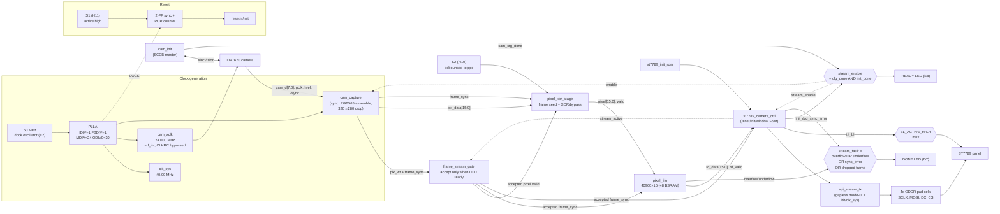

# Tang Primer 25K OV7670 → ST7789 Live Camera Stream

Pure-Verilog live camera viewfinder for the **Sipeed Tang Primer 25K**
(Gowin GW5A-25A, on the 25K Dock): an OV7670 camera is streamed straight to
an ST7789 TFT/IPS panel with **no CPU, no external RAM, and no full frame
buffer**. The ST7789's own GRAM is the frame store; the FPGA only carries a
small FIFO to absorb the difference between the camera's bursty active-video
timing and the panel's constant SPI drain rate.

```text
OV7670 RGB565 → center-crop 320×240 to 280×240
              → optional frame-seeded XOR-map stage
              → 40960×16 synchronous FIFO (48 GW5A BSRAM)
              → ST7789 RAMWR stream
```

Top-level entity: **`tangprimer25k_st7789_top`**
(`tangprimer25k_st7789_top.v`).

This design was originally built for the iCEBreaker (Lattice iCE40UP5K) and
ported here. [§12](#12-what-the-port-changed) is the summary of what had to
change and why; everything between the top level and the pads is the same RTL.

---

## 1. Repository layout

| Path | Role |
|---|---|
| `tangprimer25k_st7789_top.v` | Top level: PLL, POR/reset, camera XCLK, ODDR SPI pad cells, SCCB IO buffer, buttons, status LEDs |
| `gowin_pll.v` | `PLLA` wrapper: 50 MHz dock oscillator → 40 MHz `clk_sys`, 24 MHz camera XCLK, 100 MHz capture clock |
| `async_fifo.v` | Gray-pointer dual-clock FIFO carrying pixels from the capture domain into `clk_sys` |
| `btn_debounce.v` | Synchronizer + integrate-and-commit debouncer for one pushbutton |
| `status_led.v` | Turns the two board LEDs into a frame heartbeat and a blink-coded fault index |
| `test_pattern_src.v` | Frame-static diagnostic pattern with the camera's exact timing |
| `tangprimer25k_pattern_top.v` | Diagnostic top: same design, `test_pattern_src` instead of the camera |
| `cam_init.v` | OV7670 SCCB (I²C-like) master — writes the register table on power-up |
| `cam_capture.v` | Oversamples PCLK/HREF/VSYNC on the 100 MHz capture clock, assembles RGB565 bytes, crops 320→280 columns |
| `frame_stream_gate.v` | Atomically accepts a frame only when the display is ready; drops busy-time frames without flushing/mixing FIFO data |
| `pixel_xor_stage.v` | Per-frame seed generator, frame-safe bypass mux, and pixel/XOR-map integration |
| `xormap_32.v` | Iterative 32-bit XOR map with a 16-bit folded output |
| `pixel_fifo.v` | 40960×16 single-clock FIFO absorbing the camera/panel rate difference (infers 48 BSRAM) |
| `st7789_camera_ctrl.v` | ST7789 reset/init/address-window FSM, streams FIFO pixels into RAMWR |
| `st7789_init_rom.v` | Combinational ROM: the known-working ST7789 register-init sequence |
| `spi_stream_tx.v` | Gapless mode-0 SPI byte engine, one bit per `clk_sys` cycle; device-independent (the DDR pad cells live in the top level) |
| `tangprimer25k.cst` | Physical constraints — pin table in [§7](#7-wiring--pinout) |
| `tangprimer25k.sdc` | Timing constraints |
| `tangprimer25k.gprj` | Gowin project file (device + source list) |
| `build.tcl` | Headless `gw_sh` script: sets the dedicated-pin overrides, then `run all` |
| `Makefile` | `gw_sh` → `openFPGALoader` build/program flow, plus `sim` and `timing` |
| `tb_spi_gowin_io.v` | Pad-level testbench for the ODDR SPI cells (see [§4.2](#42-spi-pad-cells-sb_io--oddr)) |
| `tb_frame_recovery.v` | Reproduces the starved-frame deadlock and proves the watchdog clears it |
| `tb_cam_capture.v` | Drives a synthetic OV7670 through the capture path and the clock crossing, checking every pixel by coordinate |
| `build_pattern.tcl` | `build.tcl` with the diagnostic top selected |
| `timing_check.py` | Recomputes the clock/line-rate/FIFO-margin numbers in [§4](#4-clock-plan) and [§5](#5-line-rate-proof) |
| `docs/SETUP.md` | One-time Gowin CLI toolchain setup on macOS, and board notes |
| `docs/install-gowin-cli.sh` | Idempotent installer for that setup |
| `unused/` | RTL **not** part of the build — see [§1.1](#11-unused--reference-rtl) |

### 1.1 Unused / reference RTL

`unused/` holds the earlier standalone ST7789 test-pattern design this was
built from, plus the retired iCE40 build. None of it is in the Makefile's
`SOURCES` list or `tangprimer25k.gprj`.

| Path | Role |
|---|---|
| `unused/icebreaker_st7789_top.v` | The iCE40UP5K top level this port replaced (`SB_PLL40_PAD` + `SB_IO` cells) |
| `unused/icebreaker.pcf` | Its nextpnr pin constraints |
| `unused/st7789_rgb_test.v` | Old standalone top: reset + init ROM + CASET/RASET/RAMWR + a combinational test-pattern generator, no camera |
| `unused/rgb_test_pattern.v` | Combinational RGB565 test-pattern generator instantiated only by `st7789_rgb_test.v` |
| `unused/spi_master_tx.v` | Older one-cycle-per-bit SPI engine (superseded by `spi_stream_tx.v`'s DDR engine) |
| `unused/timing_39MHz.patch` | Historical iCE40 PLL patch, kept only for the record |

---

## 2. Module tree

```text
tangprimer25k_st7789_top                     (PLL, POR/reset, XCLK gen, LEDs, pad cells)
│
├─ gowin_pll  "pll"                           50 MHz → 40 / 24 / 100 MHz
│    └─ PLLA                                  [GW5A primitive]
│
├─ btn_debounce  "s2_button"                  S2 → one clean toggle pulse per press
│
├─ status_led  "status"                       frame heartbeat + blink-coded fault
│
├─ cam_init  "camera_config"                  OV7670 SCCB register-write master
│    (drives cam_sioc directly; siod_low → IOBUF below)
│
├─ IOBUF  "cam_siod_io"                       [GW5A primitive] open-drain SCCB data pin
│
├─ cam_capture  "capture"                     RGB565 capture / crop / frame-sync
│    (enable = stream_enable = cam_cfg_done && lcd_init_done)
│
├─ frame_stream_gate  "frame_gate"            accept ready frames / drop busy frames
│
├─ pixel_xor_stage  "encryption"              optional frame-seeded pixel XOR
│    └─ xormap_32  "map"                      iterative 32-bit XOR map
│
├─ async_fifo  "cdc"                          clk_cap → clk_sys pixel crossing
│
├─ pixel_fifo  "fifo"                         40960×16 surplus FIFO (48 BSRAM)
│
├─ st7789_camera_ctrl  "display"              ST7789 reset/init/window/pixel-stream FSM
│    ├─ st7789_init_rom  "init_rom"           combinational panel-init byte ROM
│    └─ spi_stream_tx  "spi"                  gapless mode-0 SPI bit engine
│
├─ ODDR  "tft_sclk_io"                        [GW5A primitive] → tft_scl  (SCLK)
├─ ODDR  "tft_mosi_io"                        [GW5A primitive] → tft_sda  (MOSI)
├─ ODDR  "tft_dc_io"                          [GW5A primitive] → tft_dc
└─ ODDR  "tft_cs_io"                          [GW5A primitive] → tft_cs
```

`tft_res` and `tft_blk` are driven straight from the top level; they only move
on millisecond timescales, so they need no pad retiming.
`tft_blk` is `assign tft_blk = BL_ACTIVE_HIGH ? bl_raw : ~bl_raw;`, where
`bl_raw` comes from `st7789_camera_ctrl`'s `tft_bl` output.

---

## 3. Block diagram


```mermaid
flowchart LR
    subgraph CLK["Clock generation"]
        OSC["50 MHz\ndock oscillator (E2)"] --> PLL["PLLA\nIDIV=1 FBDIV=1\nMDIV=24 ODIV0=30"]
        PLL --> SYS["clk_sys\n40.00 MHz"]
        PLL --> XCLKW["cam_xclk\n24.000 MHz\n= f_int, CLKRC bypassed"]
        PLL --> CAP["clk_cap\n100.00 MHz"]
    end

    subgraph RST["Reset"]
        BTN["S1 (H11)\nactive high"] --> SYNC["2-FF sync +\nPOR counter"]
        PLL -. LOCK .-> SYNC
        SYNC --> RESETN["resetn / rst"]
    end

    XCLKW --> CAM["OV7670 camera"]

    SCCB["cam_init\n(SCCB master)"] <-- "sioc / siod" --> CAM
    SCCB -- cam_cfg_done --> EN{{stream_enable\n= cfg_done AND init_done}}

    CAM -- "cam_d[7:0], pclk, href, vsync" --> CAP["cam_capture\n(sync, RGB565 assemble,\n320→280 crop)"]
    EN -. enable .-> CAP

    CAP -- "pix_wr + frame_sync" --> GATE["frame_stream_gate\naccept only when LCD ready"]
    CTRL -. stream_active .-> GATE
    BTN2["S2 (H10)\ndebounced toggle"] --> ENC
    CAP -- "pix_data[15:0]" --> ENC["pixel_xor_stage\nframe seed + XOR/bypass"]
    GATE -- "accepted pixel valid" --> ENC
    CAP -- frame_sync --> ENC
    GATE -- "accepted frame_sync" --> FIFO["pixel_fifo\n40960×16 (48 BSRAM)"]
    ENC -- "pixel[15:0], valid" --> FIFO
    GATE -- "accepted frame_sync" --> CTRL

    FIFO -- "rd_data[15:0], rd_valid" --> CTRL["st7789_camera_ctrl\n(reset/init/window FSM)"]
    ROM["st7789_init_rom"] --> CTRL
    EN -. stream_enable .-> CTRL

    CTRL --> SPI["spi_stream_tx\n(gapless mode-0, 1 bit/clk_sys)"]
    SPI --> IOC["4x ODDR pad cells\nSCLK, MOSI, DC, CS"]
    IOC --> TFT["ST7789 panel"]
    CTRL -- "tft_bl" --> BLMUX{{"BL_ACTIVE_HIGH\nmux"}} --> TFT

    CTRL -- init_done --> EN
    CTRL -- lcd_sync_error --> FAULT{{"stream_fault =\noverflow OR underflow\nOR sync_error\nOR dropped frame"}}
    FIFO -- overflow/underflow --> FAULT
    EN --> LEDR["READY LED (E8)"]
    FAULT --> LEDD["DONE LED (D7)"]
```

The camera/display datapath runs entirely in the single `clk_sys` (40.00 MHz)
domain — `cam_pclk` is sampled as synchronized *data*, never used as an RTL
clock. Both buttons pass through synchronizers before entering any logic.

---

## 4. Clock plan

| Clock | Value | Source |
|---|---:|---|
| Dock oscillator | 50.000 MHz | Tang Primer 25K Dock, pin E2 |
| FPGA system clock (`clk_sys`) | 40.000 MHz | `PLLA` CLKOUT0 |
| ST7789 SCLK | 40.000 MHz (40.45MHZ) | `clk_sys`, via DDR SPI engine |
| OV7670 XCLK | 24.000 MHz (55MHZ) | `PLLA` CLKOUT1 |
| OV7670 internal clock | 24.000 MHz | XCLK, `CLKRC = 0x00` (no prescale) |
| OV7670 PCLK | 12.000 MHz (13.89MHZ) | QVGA scaling, PCLK / 2 |
| Camera capture clock (`clk_cap`) | 100.000 MHz | `PLLA` CLKOUT2 |

PLL settings: `IDIV_SEL=1`, `FBDIV_SEL=1`, `MDIV_SEL=24` (`f_vco = 50 MHz ×
24 = 1200 MHz`), then `ODIV0=30 → 40 MHz`, `ODIV1=50 → 24 MHz`,
`ODIV2=12 → 100 MHz`.

### 4.1 Why 40.00 MHz, and why 30 fps

Frame rate depends on exactly one thing:

```text
fps = f_int / 799,680          (510 lines × 1568 internal clocks)
```

The OV7670's frame period is a fixed number of internal clocks. QVGA decimates
the *output*; it does not shorten the array scan. So nothing about the panel,
the SPI rate or the crop changes the frame rate — only `f_int` does. At the
sensor's rated maximum of 24 MHz that is **30.0 fps**, and the panel at 40 MHz
SCLK can sustain 37.2, so the camera is no longer the limit and the panel is
not yet one.

`clk_sys` stays at 40 MHz precisely so that remains true: it is the iCE40
build's proven 39 MHz rounded to a clean PLL ratio, and pushing it would raise
SCLK past what this panel has been shown to tolerate. XCLK gets its own PLL
output instead of a division of `clk_sys`, because dividing would only offer
20 MHz (25 fps) or 13.3 MHz (16.7 fps).

**Where the 12.5 fps came from.** The iCEBreaker design ran `f_int` at
`clk_sys/4` (XCLK = `clk_sys/2`, then `CLKRC = /2`), which made the camera's
active-video pixel rate exactly equal to the panel's drain rate:

```text
camera pixel rate = f_int/4 = clk_sys/16
panel  pixel rate = SPI/16  = clk_sys/16     ← identical, by construction
```

With the rates identical the FIFO never accumulates — one pixel in, one out —
which is why 256 entries sufficed. That balance is also exactly what pinned
the frame rate at a quarter of what the panel could take.

Getting to 30 fps therefore took two things, and only two:

1. **Bypass `CLKRC`** (`0x00` instead of `0x01`) and give XCLK its own 24 MHz
   clock. This is the entire frame-rate change. The camera then outruns the
   panel during active video and the surplus has to be held — see
   [§5](#5-frame-rate-and-buffering).
2. **Move the camera sampling off `clk_sys`.** PCLK doubles with `f_int`, and
   `cam_capture` samples it as data. With `CLKRC` bypassed PCLK is `clk_sys/4`
   *structurally* — whatever `clk_sys` is — so sampling in `clk_sys` was pinned
   at 4 samples per PCLK period and no clock change could improve it. It now
   runs on a dedicated 100 MHz PLL output (8.3 samples) and `async_fifo`
   carries pixels into `clk_sys`.

The second point is about tolerance, not frequency headroom. `cam_capture`
only needs one sampling edge inside each PCLK phase, so what the ratio really
sets is how far the PCLK duty cycle may drift before a phase is missed
entirely: **~30% at 40 MHz, ~12% at 100 MHz**. The OV7670 does not specify a
PCLK duty cycle and jumper wiring skews it further. `make sim-camera`
demonstrates the difference — with a 25% duty PCLK, sampling at 40 MHz drops
10,388 of 67,200 pixels per frame and sampling at 100 MHz drops none. A
dropped pixel per line is exactly what makes straight lines lean on the panel.

`USE_PLL=0` is a degraded fallback that clocks everything from the raw 50 MHz
oscillator; it has no 24 MHz or 100 MHz source, so `SYS_CLK_HZ`, `SPI_HZ` and
`CAM_XCLK_HZ` all need overriding to match and 30 fps is not available.

### 4.2 SPI pad cells: `SB_IO` → `ODDR`

`spi_stream_tx` emits one bit per `clk_sys` cycle, so SCLK has to toggle at
the full `clk_sys` rate and cannot come out of ordinary fabric flops. On iCE40
that was an `SB_IO` DDR cell for SCLK plus `NEG_TRIGGER` (falling-edge) cells
for MOSI/DC. Gowin's `ODDR` drives `D0` while the clock is high and `D1` while
it is low, which reproduces the same "SCLK = active AND clk_high"
one-discrete-pulse-per-bit behaviour.

What does *not* carry over is latency: an `SB_IO` output register is one cycle
deep, Gowin's `ODDR` is three. Two consequences, both handled in the top level:

1. **MOSI/DC still have to lead SCLK by half a cycle.** Feeding `D0` with the
   bit delayed one cycle and `D1` with the undelayed bit puts the pad
   transition in the middle of the cycle before the pulse. Writing `b(N)` for
   the bit presented in cycle N: MOSI holds `b(N)` from mid-cycle N+3 to
   mid-cycle N+4, and SCLK (fed the *delayed* "active" flag, so its pulse for
   `b(N)` lands in cycle N+4) rises at the start of cycle N+4 — half a cycle
   of setup and half a cycle of hold, as on iCE40.
2. **CS has to move with the data.** `st7789_camera_ctrl` deasserts `tft_cs_n`
   two cycles after the last bit's cycle. That was safe when the pad trailed
   the fabric by one cycle and is *not* safe at four: CS would rise two cycles
   before the final SCLK pulse and truncate the last byte of every burst.
   Routing CS through its own `ODDR` gives it the identical path.

`tb_spi_gowin_io.v` (`make sim`) checks all of this at the pads against
Gowin's own `ODDR` behavioural model from `simlib/gw5a/prim_sim.v`, the way
the iCE40 build checked itself against `SB_IO` in `cells_sim.v`. It drives the
real `st7789_camera_ctrl` through a full reset → init → window → pixels → idle
cycle (shrunk to an 8×2 window) and asserts that every byte reconstructed by
clocking MOSI on SCLK edges matches the byte `spi_stream_tx` accepted, that
MOSI/DC are stable either side of every sampling edge, that CS is low at every
edge, and that SCLK pulses are discrete rather than merged. Three deliberately
broken variants (CS without the matching cell, MOSI without the mid-cycle
split, SCLK without the extra delay) were each confirmed to fail it, so the
test is not vacuous.

---

### 4.3 Why `cam_capture` does not simply clock on PCLK

Clocking on PCLK is the textbook answer for a source-synchronous parallel bus:
sample the data with the strobe that accompanies it and setup/hold becomes a
property of the sensor's own timing rather than of how fast an unrelated
sampling clock happens to be. It removes the duty-cycle question entirely
instead of buying margin against it.

It was implemented that way first — `cam_capture` clocked on `cam_pclk`, with
`async_fifo` crossing into `clk_sys` exactly as it does now. **Gowin IDE
V1.9.11.03's router segfaults (exit 139) on this design whenever an external
pin drives a fabric clock domain.** It was reproduced against:

- both a general-purpose pin (B11) and a clock-capable one (C11, `GCLKT_13`);
- `route_option` 1 and 2, and `place_option` 2;
- with and without the 24 MHz clock net, with and without an asynchronous
  reset on the PCLK flops, and at two different FIFO depths.

Synthesis always completes; placement always completes; routing always dies at
the same point. Moving that one clock back inside the chip — the identical RTL
otherwise — routes cleanly every time. GW5A has no `BUFG`-style primitive to
instantiate explicitly, so there is no obvious handle to force different clock
routing.

The oversampling version is what ships. It gets the same 30 fps with the same
panel clock, and the duty-cycle tolerance it gives up is measured rather than
assumed (§4.1). If a later Gowin release fixes the router, the PCLK-clocked
receiver is a small, well-understood change back.

---

## 5. Frame rate and buffering

```text
frame rate        = 24.000 MHz / 799,680        = 30.01 fps
camera frame      = 799,680 / 24.000 MHz        = 33.32 ms
panel frame       = 280 × 240 × 16 / 40.000 MHz = 26.88 ms  (ceiling 37.2 fps)
                                                   6.44 ms to spare
```

The panel finishes each frame before the next VSYNC, so no frames are dropped.
What it cannot do is keep up *during* active video:

```text
active video span = 240 × 1568 / 24.000 MHz     = 15.68 ms   (worst case)
pixels in         = 280 × 240                   = 67,200
pixels drained    = 15.68 ms × 40 MHz / 16      = 39,200
peak FIFO         =                               28,000 pixels
```

Hence `FIFO_DEPTH = 40960` (68% used, 48 of 56 BSRAM blocks). `pixel_fifo`
wraps its pointers explicitly rather than relying on natural rollover, so the
depth need not be a power of two — which matters here, because 65536 pixels
would be 1024 Kb and would not fit in the device's 1008 Kb of BSRAM at all. A
*full* 280×240×16 framebuffer is 1050 Kb and likewise does not fit; only the
deficit needs storing, and it is a quarter of that.

The 28,000 figure assumes the sensor emits its 240 QVGA output lines in
consecutive line periods. Two bounds either side of it:

- If vertical DCW decimation spreads them over 480 line periods, as it
  probably does, the panel keeps up throughout and the FIFO only holds an
  intra-line ripple of a few hundred pixels.
- If HREF had *no* horizontal blanking at all — impossible, but it is the hard
  floor on how quickly 240 lines can arrive — the deficit would be 35,200.

40960 covers even the second case, which is why it was chosen over the
tidier 32768 (which covers 28,000 with 17% to spare but not 35,200).

Run:

```sh
make timing        # python3 timing_check.py
```

to recompute all of the above from the live clock parameters. It asserts the
conditions that must hold — the panel finishing inside a camera frame, the
deficit fitting in the FIFO, the FIFO fitting in BSRAM, and the capture clock
staying well above PCLK — so it fails loudly if a clock is retuned without
resizing the buffer.

---

## 6. Display geometry & camera configuration

- Panel operated in landscape mode: `MADCTL = 0xA0`.
- Visible stream: 280 × 240 pixels. `CASET = 20..299`, `RASET = 0..239`.
- Camera: QVGA 320 × 240 RGB565 (`COM7 = 0x14`); crop removes 20 columns
  from each horizontal side.
- Pixel format: RGB565, high byte first (swap `{hi_byte, d_s1}` in
  `cam_capture.v` if colors come out byte-swapped on your unit).
- ST7789 hardware reset timing and init register sequence are retained
  byte-for-byte from the working display-only project.

### Frame-seeded XOR-map stage

For an accepted encrypted frame, the accepted `cam_capture.pix_wr` strobe
advances `xormap_32` exactly once per retained RGB565 pixel. In bypass mode
the map does not load or advance. The accepted-frame pulse loads a new 32-bit
seed before the first pixel. The seed generator is a nonzero 32-bit LFSR
stepped once per accepted frame, so it produces a deterministic pseudo-random
seed sequence from `XORMAP_INITIAL_SEED`; it is not a hardware true-random
generator.

The runtime mode is frame-safe: **S2 toggles encryption on/off**, and the
request takes effect on the next accepted frame boundary, never partway
through the current image. Reset returns to `ENCRYPTION_DEFAULT` (default `0`,
bypass). Setting the top-level `ENABLE_XORMAP` parameter to `0` makes the
encryption stage a hard pass-through and allows synthesis to remove the map.

`frame_stream_gate` prevents spatial mixing when camera/display timing slips.
If a new camera frame arrives while the LCD controller is still streaming,
the FIFO is left intact so the old transfer can finish and every pixel from
the new frame is suppressed. The next frame arriving while the LCD is idle is
accepted, flushes stale FIFO contents, and starts a complete new display
window. A rejected frame lights the sticky fault LED.

If a genuine camera fault produces an incomplete accepted frame, the LCD
controller can remain waiting for its missing pixels. Use **S1** to recover
from that persistent fault-LED condition; ordinary busy-frame rejection
recovers automatically at the next ready frame.

There is no decryptor after the FIFO, so the display intentionally shows
scrambled RGB565 values while the stage is enabled. This XOR map is a linear,
32-bit visual scrambler, not a cryptographically secure cipher; applications
requiring confidentiality should use a reviewed cipher and proper key/nonce
management.

Key OV7670 register deltas from the stock reference table (full table in
`cam_init.v`):

| Register | Value | Purpose |
|---|---:|---|
| `COM7` (0x12) | 0x14 | QVGA selection + RGB output |
| `CLKRC` (0x11) | 0x00 | no prescale: internal clock = XCLK = 24 MHz |
| `DBLV` (0x6B) | 0x0A | camera 4× PLL disabled |
| `COM3` (0x0C) | 0x04 | enable downsample/crop (DCW) path |
| `COM14` (0x3E) | 0x19 | manual QVGA scaling, PCLK / 2 |
| `RGB444` (0x8C) | 0x00 | disable RGB444 |
| `COM15` (0x40) | 0xD0 | RGB565, full range |
| `0x70–0x73`, `0xA2` | QVGA set | 320×240 scaling registers |

Color matrix and windowing/scaling registers are carried over verbatim from
a previously proven configuration.

### Image-quality tuning block

The original register table never programmed `COM8`, AEC/banding parameters,
AWB tuning, pixel correction/edge enhancement, or the gamma curve — those all
sat at chip reset defaults, which on the OV7670 tends to show up as a
purple/magenta color cast, exposure hunting or visible banding under
artificial light, salt-and-pepper pixel noise, and flat/washed-out contrast.
`cam_init.v` appends a second block of register writes (entries 61–117 of the
ROM) sourced verbatim from the mainline Linux kernel `ov7670` driver's default
register set — the most widely deployed, long-proven OV7670 tuning reference —
restricted to registers that don't touch this design's timing-critical
settings (`CLKRC`, `COM7`, `COM3`, `COM14`, the window/scaling registers,
`DBLV`):

| Block | Registers | Purpose |
|---|---|---|
| AEC operating region / banding | `AEW`, `AEB`, `VPT`, `COM11`, `BD50MAX`, `BD60MAX`, `HAECC1-7` | Stable auto-exposure operating range plus 50/60 Hz banding-filter auto-detect |
| Auto-control enable | `COM8` = `0xFF` | Fast AGC/AEC, unlimited AEC step, banding filter, AGC, AEC, AWB |
| AWB tuning | `BLUE`, `RED`, `0x43-0x48`, `0x59-0x5E`, `0x6A`, `0x6C-0x6F`, `COM16` | Standard fix for the OV7670's purple/magenta color cast |
| Pixel correction / edge | `EDGE`, `0x75`, `REG76`, `0x4B`, `0x77`, `0xC9` | `REG76` in particular suppresses white/black speckle noise |
| Gamma curve | `GAM1-15`/`SLOP` (`0x7A-0x89`) | Replaces the flat reset-default tone curve |

Total SCCB table time is ~290 ms at the 100 kHz bit rate — still comfortably
under the ST7789's own ~500 ms init, so `BOOT_TICKS`/`GAP_TICKS`/`RST_TICKS`
did not need re-tuning. Only `TICK_DIV` is clock-dependent, and the top level
computes it as `SYS_CLK_HZ/400000`.

`COM9` (AGC gain ceiling) was deliberately left at its existing `0x38`
(16× ceiling) rather than the Linux driver's more conservative `0x18` (4×):
a higher ceiling brightens low-light video at the cost of more visible
sensor noise/grain. If graininess in dim conditions is part of the
"quality" complaint, lowering `COM9`'s bits `[6:4]` is the next knob to try.

---

## 7. Wiring / pinout

Tang Primer 25K PMOD signals are 3.3 V. Use an OV7670 breakout explicitly
rated for 3.3 V logic — a bare sensor needs its own rails and level
translation. Connect camera and display grounds together, and never expose
FPGA pins to more than 3.3 V.

All three PMOD headers are used: **J4 and J5 carry the OV7670** (one row of
the sensor's ribbon header each) and **J6 carries the ST7789**. On every PMOD,
**p5/p11 are GND and p6/p12 are +3V3**; the eight signal pins are p1–p4 and
p7–p10:

```text
         p1  p2  p3  p4  p5(GND)  p6(3V3)
         p7  p8  p9  p10 p11(GND) p12(3V3)
```

### PMODs J4 + J5 — OV7670

The camera's 18-pin (2×9) ribbon header is split one row per PMOD, in the
sensor board's own pin order, so a ribbon cable maps straight across. The two
supply pins come off the PMOD power pins, leaving exactly the eight signals
per row that a PMOD carries.

**J4 — OV7670 odd row**

| OV7670 header | PMOD pin | FPGA ball | Signal |
|---|---|---|---|
| 3V3 | p6 / p12 | — | +3V3 |
| SIOC | p1 | G11 | `cam_sioc` (SCCB clock) |
| VSYNC | p2 | D11 | `cam_vsync` |
| PCLK | p3 | B11 | `cam_pclk` |
| D7 | p4 | C11 | `cam_d[7]` |
| D5 | p7 | G10 | `cam_d[5]` |
| D3 | p8 | D10 | `cam_d[3]` |
| D1 | p9 | B10 | `cam_d[1]` |
| RESET | p10 | C10 | `cam_rst_n` |

**J5 — OV7670 even row**

| OV7670 header | PMOD pin | FPGA ball | Signal |
|---|---|---|---|
| GND | p5 / p11 | — | GND |
| SIOD | p1 | A11 | `cam_siod` (SCCB data) |
| HREF | p2 | E11 | `cam_href` |
| XCLK | p3 | K11 | `cam_xclk` |
| D6 | p4 | L5 | `cam_d[6]` |
| D4 | p7 | A10 | `cam_d[4]` |
| D2 | p8 | E10 | `cam_d[2]` |
| D0 | p9 | L11 | `cam_d[0]` |
| PWDN | p10 | K5 | `cam_pwdn` |

The 8-bit data bus therefore lands interleaved across two connectors — odd
bits on J4, even bits on J5. That is purely a wiring convenience;
`cam_capture` samples the bus synchronously and does not care where the bits
sit.

`cam_siod` is open-drain (driven low only, released otherwise) and uses the
pin's internal pull-up (`PULL_MODE=UP`); a 4.7 kΩ external pull-up to 3.3 V
may help if SCCB wiring is long. `cam_sioc` is push-pull.

### PMOD J6 — ST7789 display

| PMOD pin | FPGA ball | Signal |
|---|---|---|
| p1 | F5 | `tft_blk` (backlight) |
| p2 | G7 | `tft_cs` |
| p3 | H8 | `tft_dc` |
| p4 | H5 | `tft_res` |
| p7 | G5 | `tft_sda` (MOSI) |
| p8 | G8 | `tft_scl` (SCK) |
| p9 | H7 | *unused* |
| p10 | J5 | *unused* |

### Dock board

| Signal | FPGA ball | Notes |
|---|---|---|
| `clk50` | E2 | 50 MHz oscillator; needs `use_cpu_as_gpio` + `use_sspi_as_gpio` |
| `btn_s1` | H11 | Button **S1**, active high (100R to +3V3, internal pull-down) |
| `btn_s2` | H10 | Button **S2**, active high |
| `led_ready` | E8 | READY status LED; needs `use_ready_as_gpio` |
| `led_done` | D7 | DONE status LED; needs `use_done_as_gpio` |

> **Provenance.** The PMOD tables above come from the dock schematic
> (`Tang_Primer_25K_Dock_60033_Schematic.pdf`, sheet 1), converted from the
> schematic symbol's pin numbering to physical header numbering, and
> cross-checked two ways: against litex-boards'
> `sipeed_tang_primer_25k` connector definitions, and against Sipeed's own
> `pmod_lcd`, `pmod_hub75e`, `nestang-25k` and `hdmi` examples (whose
> differential HDMI pairs land on vertically adjacent header pins exactly as
> this table predicts). The button nets are literally named `H11_IOT3A_S1`
> and `H10_IOT3B_S2` in the schematic. Sipeed's `pmod_led` example is *not* a
> reliable source — see `docs/SETUP.md`.
>
> One thing that is **not** verified from a primary source: whether the
> READY/DONE LEDs light on a logic 1 or a logic 0. `LED_ACTIVE_HIGH` (default
> `1`) flips it; if the two status LEDs read inverted on your board, set it
> to `0`. Nothing else depends on this.

---

## 8. Build, simulate and program

Required tools: `gw_sh` (Gowin IDE, headless) and `openFPGALoader`. See
`docs/SETUP.md` for the one-time macOS setup — including *why* `gw_sh` needs
a wrapper script — and run `bash docs/install-gowin-cli.sh` to do it.
`make sim` additionally needs `iverilog`.

```sh
make               # gw_sh build.tcl -> impl/pnr/tangprimer25k.fs
make prog          # openFPGALoader -b tangprimer25k  ... (SRAM, volatile)
make flash         # openFPGALoader -b tangprimer25k -f ... (SPI flash, persists)

make pattern       # diagnostic build: test pattern instead of the camera
make prog-pattern  # load it

make sim           # all three testbenches
make sim-spi       # pad-level ODDR SPI phase
make sim-recovery  # starved-frame deadlock / watchdog
make sim-camera    # capture path + clock crossing, every pixel by coordinate
make timing        # python3 timing_check.py
make clean         # rm -rf impl
```

`make pattern` swaps in `test_pattern_src` — same pins, same constraints, same
downstream RTL, but a known frame-static picture with the camera's exact pixel,
line and frame timing. It bisects the pipeline: a clean, square, stable grid
means the panel, SPI pads, FIFO, frame gate and panel FSM are all correct and
any fault is the camera, its SCCB configuration, or `cam_capture`. It also runs
with no camera attached, since SCCB is write-only and never checks for an ACK.

`build.tcl` releases the four dedicated pins this design needs
(`use_cpu_as_gpio`, `use_sspi_as_gpio`, `use_ready_as_gpio`,
`use_done_as_gpio`) and nothing else — JTAG stays JTAG, so the board remains
reprogrammable.

---

## 9. Status LEDs, buttons, and backlight

The dock has no general-purpose user LED, so the two configuration-status
LEDs are repurposed:

Two LEDs cannot localise a fault by being on or off, so they carry patterns
instead (`status_led.v`):

- **READY LED (E8)**
  - *short pulse every 1.5 s* — alive, but SCCB config and/or panel init not
    finished. Deliberately slow and asymmetric so it cannot be mistaken for
    the flicker below.
  - *rapid flicker* — frames are completing. It toggles once per frame, so
    ~15 Hz at 30 fps.
  - *steady on or off* — initialisation finished but frames are **not**
    completing; the panel stream is stalled.
- **DONE LED (D7)** — off means no fault has latched. Otherwise it blinks the
  index of the *first* sticky fault, pauses, and repeats:

  | Blinks | Fault | Meaning |
  |---:|---|---|
  | 1 | FIFO overflow | camera outran the panel and the buffer filled |
  | 2 | FIFO underflow | panel read an empty FIFO |
  | 3 | frame starved | pixels stopped arriving mid-frame; the watchdog aborted it |
  | 4 | LCD sync error | a VSYNC arrived during a transfer |
  | 5 | frame dropped | panel was still busy at VSYNC |

  Indices are ordered so root causes blink fewer times than their
  consequences: 1–3 will also produce 4 and 5, so seeing 4 or 5 *alone* means
  something different from seeing them after a 1.
- **S1** — full camera and panel reset/reinitialization (also gated by the
  PLL lock and a POR counter on power-up).
- **S2** — toggle XOR-map encryption; applies at the next frame boundary.
- **Backlight (`tft_blk`)** — driven low (off) through the hardware reset
  pulse, then turned on by `st7789_camera_ctrl` as soon as the init FSM
  finishes walking `st7789_init_rom` (before the first frame streams, but
  after `SWRESET`/`SLPOUT`/gamma/`DISPON` have been sent) — it never turns
  off again afterward. `BL_ACTIVE_HIGH` (top-level parameter, default 1)
  controls the polarity of the physical pin; the ST7789 panel is a
  transmissive IPS LCD, so with the backlight off the panel shows nothing
  even though the controller is still updating GRAM normally.

---

## 10. Bring-up checklist

1. Verify `cam_xclk` (J5 p3) is approximately 24.000 MHz.
2. Verify `cam_sioc` (J4 p1) activity after reset and that the READY LED
   eventually turns on.
3. Verify `cam_pclk` (J4 p3) is approximately 12.000 MHz during active video.
   A much higher value usually means `CLKRC` or `DBLV` did not take effect.
4. Verify `tft_scl` (J6 p8) is a clean ~40 MHz square wave while streaming,
   with no runt/merged pulses — this is the first place a DDR phase mistake
   would show up. If the panel shows garbled or shifted color data instead
   of a recognizable (if unsynced) image, suspect the ODDR timing in the top
   level before anything else, and re-run `make sim`.
5. If the image colors are byte-swapped, change `{hi_byte, d_s1}` to
   `{d_s1, hi_byte}` in `cam_capture.v`.
6. If the image is mirrored or upside down, try ST7789 `MADCTL=0x60` or
   adjust OV7670 `MVFP` register `0x1E`.
7. If the DONE LED turns on, probe XCLK/PCLK first; the design depends on
   the camera accepting `CLKRC=0x01` and `DBLV=0x0A`.
8. If both status LEDs read inverted (fault LED on at rest, ready LED off
   once streaming), set `LED_ACTIVE_HIGH=0`.
9. If the picture is wrong in any way, run `make pattern && make prog-pattern`
   before debugging anything else — it splits the pipeline in half. The grid's
   verticals must be vertical: if they lean by N pixels over the 240 rows, the
   stream is losing N/240 pixels per row, which is a real defect. If the grid
   is clean, the whole downstream half is proven and the camera is at fault.

---

## 11. Verification status

**Toolchain results** (Gowin IDE V1.9.11.03 Education, `GW5A-LV25MG121NC1/I0`,
device version A):

| | |
|---|---|
| Logic | 955 / 23040 (5%) |
| Registers | 656 / 23280 (3%) |
| BSRAM | 49 / 56 (88%) — 48 SDPB (`pixel_fifo`), 1 pROM (`st7789_init_rom`) |
| IOLOGIC | 5 ODDR (SCLK, MOSI, DC, CS, camera XCLK) |
| I/O | 27 ports; 14 in, 12 out, 1 inout |
| Clocks | 4 — `clk50`, and PLL outputs at 40, 24 and 100 MHz |
| Timing | 0 setup violations, 0 hold violations over 6408 paths |
| Worst slack | 1.09 ns, on the `clk_cap → clk_sys` FIFO read |

**Simulation.** All three testbenches pass, and each was checked against a
deliberately broken variant so none of them is vacuous:

- `make sim-spi` — 105 bytes across a full init + address window + pixel burst
  reconstructed bit-exactly at the pads, 840 discrete SCLK pulses (exactly 8
  per byte), CS low at every sampling edge. Three broken pad wirings each fail
  it.
- `make sim-recovery` — a deliberately short frame must abort and the stream
  must resume with no reset. 3 of 3 frames complete; with the watchdog removed
  the same testbench completes 1 of 3 and hangs.
- `make sim-camera` — a synthetic OV7670 at real QVGA timing through
  `cam_capture` and the clock crossing: all 67,200 pixels arrive, in order,
  each matching its expected (row, column). With a 25% duty PCLK the same
  testbench drops 10,388 pixels when sampled at 40 MHz and none at 100 MHz,
  which is the measurement behind §4.1.

The behavioural tests inherited from the iCE40 build still apply to the
unchanged RTL: a complete rejected 280×240 frame (all 67,200 pixel strobes
suppressed without altering retained FIFO/map state), 336,156 frame-path
checks, and an exhaustive bypass test confirming all 65,536 RGB565 values pass
bit-for-bit while the XOR map is idle.

**Confirmed on hardware.** The panel, SPI pads, ODDR phase, FIFO, frame gate
and panel FSM all work: the diagnostic pattern build renders and animates with
no fault latched on the DONE LED.

**Not confirmed on hardware.** The camera path has not yet produced a verified
correct image, and none of the frame-rate work above has run on the board —
30.0 fps is derived, not measured. Also open: the status-LED polarity
(`LED_ACTIVE_HIGH`), and whether your dock silkscreens the three PMOD headers
in the same order as the schematic's J4/J5/J6.

---

## 12. What the port changed

Everything between `cam_capture` and `spi_stream_tx` is byte-identical RTL;
only the device-specific edges moved.

| Area | iCEBreaker (iCE40UP5K) | Tang Primer 25K (GW5A-25A) |
|---|---|---|
| Top level | `icebreaker_st7789_top.v` | `tangprimer25k_st7789_top.v` |
| Oscillator | 12 MHz | 50 MHz (E2) |
| PLL | `SB_PLL40_PAD`, DIVR/DIVF/DIVQ → 39.00 MHz | `PLLA`, IDIV/FBDIV/MDIV/ODIV0 → 40.00 MHz |
| SPI SCLK pad | `SB_IO` DDR cell | `ODDR` + one-cycle input delay |
| SPI MOSI/DC pads | `SB_IO` `NEG_TRIGGER` cells | `ODDR` with delayed `D0` / live `D1` |
| SPI CS pad | plain output | `ODDR`, to match the deeper pad latency |
| SCCB data pin | `SB_IO` open-drain + `PULLUP` | `IOBUF` + `PULL_MODE=UP` |
| Reset button | `BTN_N`, active low | **S1** (H11), active high |
| Encryption control | BTN1 sets, BTN3 clears (bounce-immune by construction) | **S2** (H10) toggles, via `btn_debounce.v` |
| Status LEDs | `LEDG_N`/`LEDR_N`, active low | READY (E8) / DONE (D7), `LED_ACTIVE_HIGH` |
| Camera clock | `clk_sys`/4 = 9.75 MHz | own 24 MHz PLL output, `CLKRC` bypassed |
| Camera capture | oversampled in `clk_sys` | own 100 MHz clock + `async_fifo` crossing |
| Pixel FIFO | 256×16, one EBR | 40960×16, 48 BSRAM |
| Starved frame | wedged the pipeline until reset | watchdog aborts the frame, stream resumes |
| Status LEDs | on/off | frame heartbeat + blink-coded fault index |
| Pin constraints | `icebreaker.pcf` (`set_io`) | `tangprimer25k.cst` (`IO_LOC`/`IO_PORT`) |
| Dedicated pins | n/a | `build.tcl` `set_option -use_*_as_gpio` |
| Build flow | yosys → nextpnr-ice40 → icepack → iceprog | `gw_sh` (`build.tcl`) → openFPGALoader |
| Frame rate | ~12.19 fps | **~30.0 fps** (see [§4.1](#41-why-4000-mhz-and-why-30-fps)) |

The one genuinely new failure mode the port introduced — and fixed — is CS
truncating the last byte of every SPI burst, because Gowin's `ODDR` pipeline
is three cycles deeper than `SB_IO`'s output register while the controller's
"deassert CS two cycles after the last bit" logic stayed the same. See
[§4.2](#42-spi-pad-cells-sb_io--oddr).
